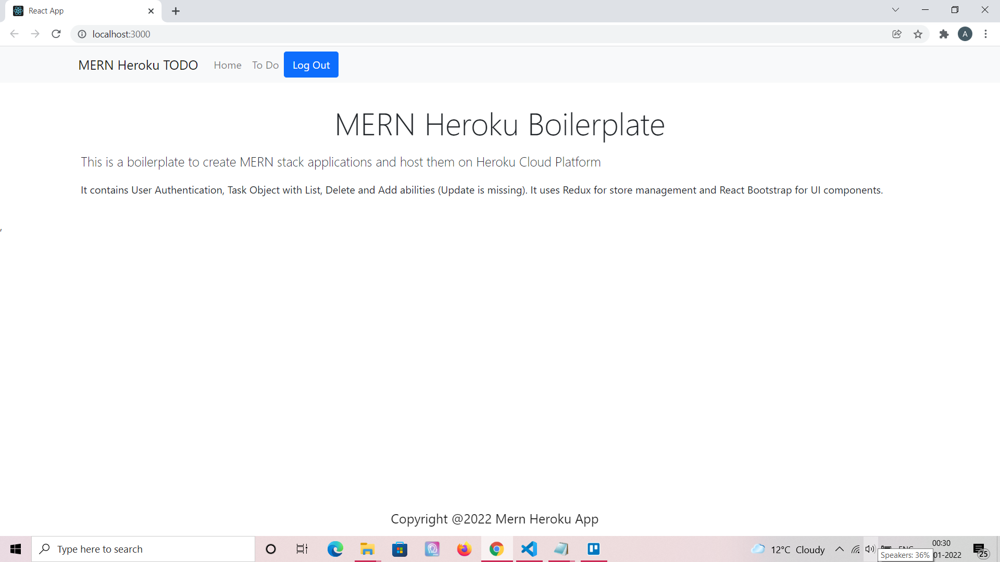
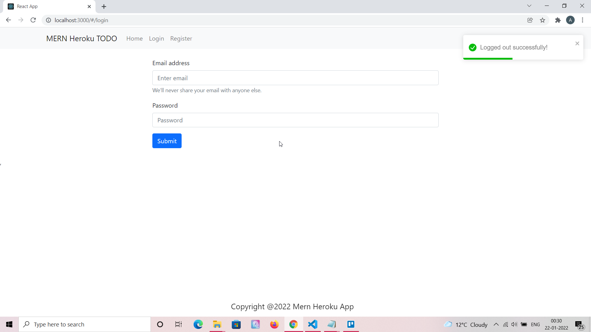
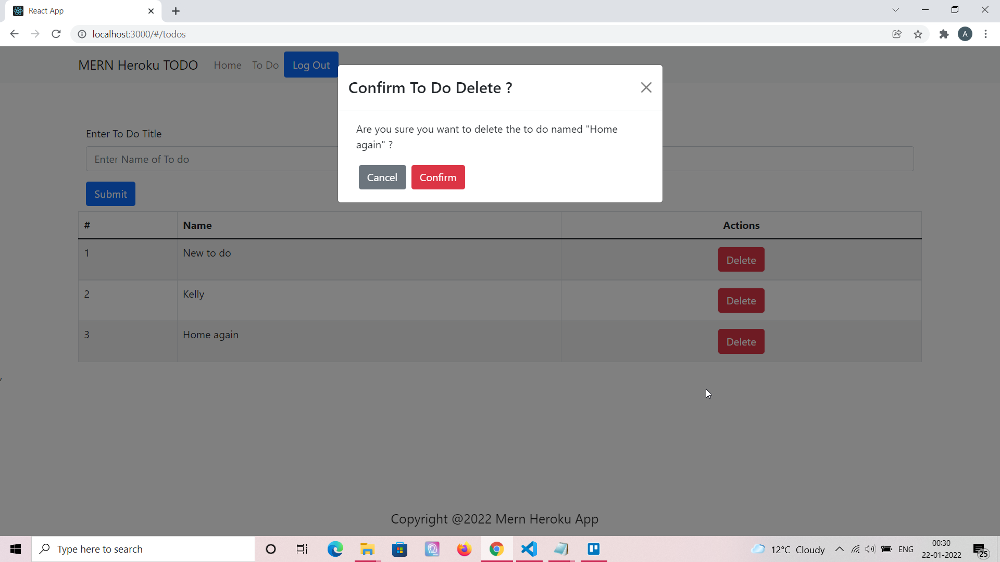

# MERN ToDO Heroku - A simple MERN App to test Heroku deployment ⚡️

## Project Briefing

It is a sample app created in MERN stack which would be deployed on Heroku for testing purposes. This might be removed in near future but for the time being it can be found live on Heroku [https://firebolt-express.herokuapp.com/](https://firebolt-express.herokuapp.com/)

Made with ❤️ by **[@apfirebolt](https://github.com/Apfirebolt/)**

Please find me here **[https://apgiiit.com/](https://apgiiit.com/)**

## Features

- Contains token based user auth system.
- UI components are written using React-Bootstrap. 
- Each user can perform CRUD on ToDos.

## Built With

* [Express](https://expressjs.com/)
* [React](https://reactjs.org/)
* [React Bootstrap](https://react-bootstrap.github.io/)
* [MongoDB](https://www.mongodb.com/)

## Project setup

Contains only back-end API and React frontend app with UI components created using React Bootstrap. Back-end is configured with package.json file at the root level. Install the dependencies, make sure you have mongoDB client installed on your system for local development or you can also use MongoDB Atlas for production deployment which does not require database to be setup on your system.

Nodemon would be serving the back-end API on local system. Heroku Post Build script is used to serve the React production build files on Heroku, proxy server is used to avoid any CORS related issues.

```
npm install
npm run server
```

## Future Features

- Might want to add test cases for front-end and back-end
- Might want to add Swagger Docs.

## Project Screenshots

Some screenshots of the project are now available which you can checkout below.



Login Page.



To do list page with delete modal which opens when you click on an item to delete. These components are powered by react-bootstrap.




